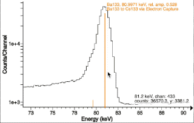

## v1.0.4 (July 21, 2019)
This release primarily improves the interactivity with the spectrum.
Download Windows, Linux, and macOS binaries from: https://github.com/sandialabs/InterSpec/releases/tag/v1.0.4 

* Bug fixes:
  * InterSpec would not start for Windows users with some non-English characters (ex, an umlaut) in their user names.  Paths with these letters also affected the file query tool, or if the open file menu item was used to open spectrum file.
  * The "Add Peak" option when a Region of Interest (ROI) is right clicked had issue resulting in peaks not actually being added
  * Windows and Linux version of app could sometimes get duplicate menu items

* New Features:
  * Based on the awesome work by [Christian Morte](https://github.com/kenmorte) of using [D3.js](https://d3js.org/) to plot spectrum files, the plotting and interacting with spectra has been completely re-written, and made substantially better.  See below videos for an overview of how to interact with the spectrum.
    * This new charting mechanism will make it easier to implement richer, more interactive features in the future.
    * On touch-devices, some touch interactions are working, but there is no timeline for when the rest will be implemented, so for now phone and tablet versions of the app will use the old charting mechanism
    * There are significant additional performance improvements and user experience improvements possible, but there is no timeline for this work
  * Added some example problems and solutions available at https://sandialabs.github.io/InterSpec/tutorials/
  * Added a few new file formats (TKA, MultiAct), and some new N42 format variants
  * A number of smaller bug fixes and improvements

### Interactions with the spectra:
  All these videos are also available within `InterSpec` by going to the **Help** &rarr; **Welcome...** menu item, and then selecting the **Controls** tab.

  * 
    * Left-click and drag to the right to zoom in, and left-click and drag to the left to zoom out (same as before).
    * Or use the energy slider chart (see below)

  * 
    * Use the right mouse button to grab and drag the spectrum left and right.
    * You can also use the vertical scroll-wheel (if your mouse or trackpad supports this) to move the chart left and right.
    * You can also "grab" the x-axis using the left mouse button to drag it left and right.
    * Or use the energy slider chart (see below)

  * 
    * Select the **View** &rarr; **Chart Options** &rarr; **Show Energy Slider** menu item to enable the slider chart.  Whether this chart is shown or not is remembered by `InterSpec` in future sessions.

  * 
    * Select the **View** &rarr; **Chart Options** &rarr; **Show Y-Axis Scalers** menu option to enable the scalers on the right side of the chart.  Scalers are only shown for the background and secondary spectra, and only when they are plotted (eg, if you are only displaying a foreground spectrum, no sliders will be shown).  The **Spectrum Files** tab has a button to re-Live-Time normalize the spectra (which `InterSpec` does by default) if you wish.  Whether these scalers are shown or not is remembered by `InterSpec` in future sessions.

  * 
    * Move your mouse to within 10 pixels of the edge of a ROI, and the cursor will change indicating you can left-click and drag the ROI edge to where you would like.  Your mouse must also be approximately within the Y-axis range of the peak as well (this is so when you have HPGe spectra with many peaks, you wont accidentally grab a ROI edge when zooming in and out).
    * Dragging one side of a ROI past the other side of a ROI will delete the ROI.

  * 
    * Same as before.  The easiest way to fit a peak is to just double click in the vicinity of the peak region.  If you want to add another peak nearby, just double click again.  You can also right-click on a peak and select to add a peak in the same region of interest (ROI).

  * 
    * <kbd>CTRL</kbd> + Left-Click-and-Drag.  When you release the mouse a menu will pop up and allow you to select how many peaks you would like in the ROI.

  * 
    * You can change the axis ranges by clicking and dragging the ticks.
    * The y-axis also responds to the mouse wheel, which lets you adjust the padding both on the top, and the bottom of the y-axis

  * 
    * <kbd>CTRL</kbd> + <kbd>ALT</kbd> + Left-Click-Drag
      * If you do this twice in a row, like first on a low energy peak, then a high energy peak (or vice versa), the dialog that pops up will have an option that will make it so both of your calibrations points will be preserved by adjusting both the gain and offset.

  * See the **Controls** tab of the **Welcome** screen in `InterSpec` for more.

