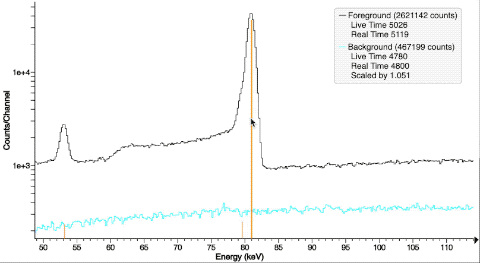

## v1.0.4 (July 21, 2019)

* Bug fixes:
  * InterSpec would not start for Windows users with some non-English characters (ex, an umlaut) in their user names.  Paths with these letters also affected the file query tool, or if the open file menu item was used to open spectrum file.
  * The "Add Peak" option when a Region of Interest (ROI) is right clicked had issue resulting in peaks not actually being added
  * Windows and Linux version of app could sometimes get duplicate menu items

* New Features:
  * Based on the awesome work by Christian Morte (@kenmorte) of using [D3.js](https://d3js.org/) to plot spectrum files, the plotting and interacting with spectra has been completely re-written, and made substantially better.  See below videos for an overview of how to interact with the spectrum.
    * On touch-devices, some touch interactions are working, but there is no timeline for when the rest will be implemented, so for now phone and tablet versions of the app will use the old charting mechanism
  * Added a few new file formats (TKA, MultiAct), and some new N42 format variants
  * Various smaller bug fixes and improvements

* Interactions with the spectra:
  * 

  * 

  * 

  * 

  * 

  * 

  * 

  * 

  * 

